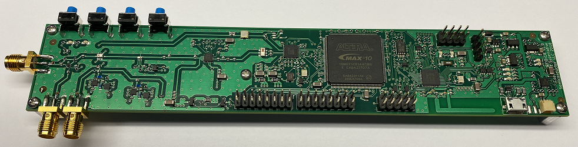
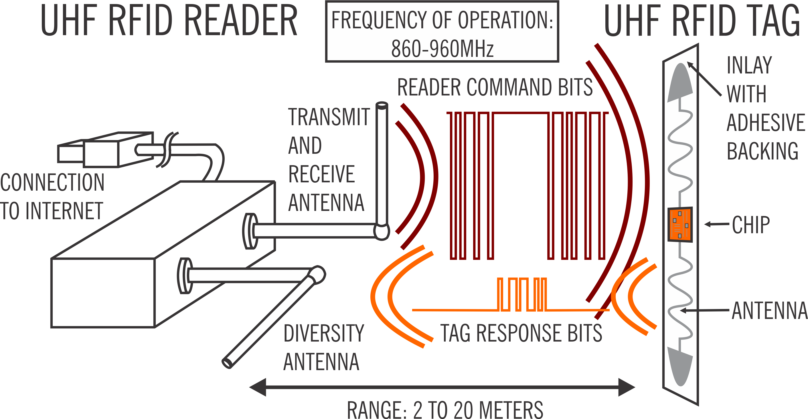
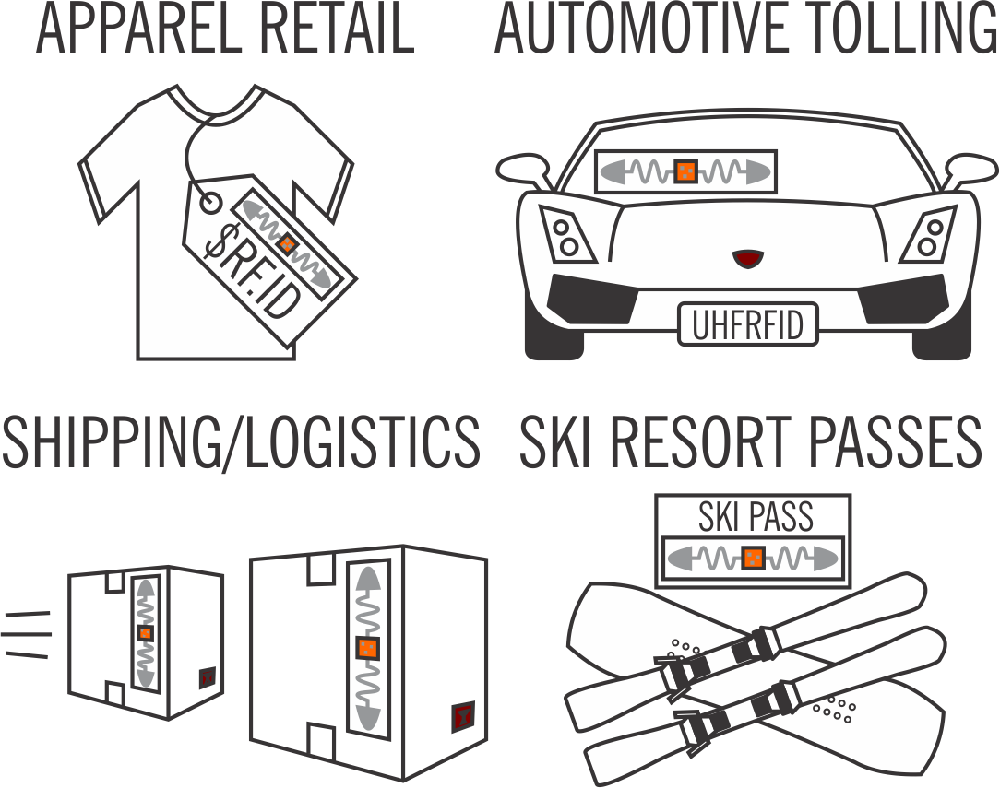
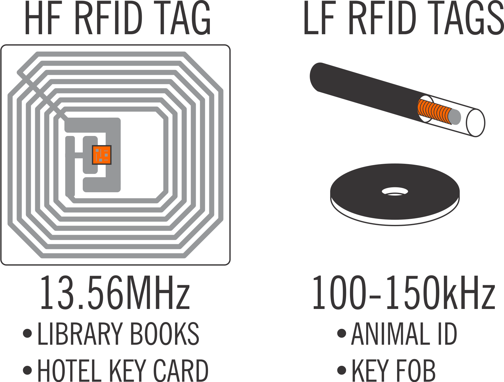
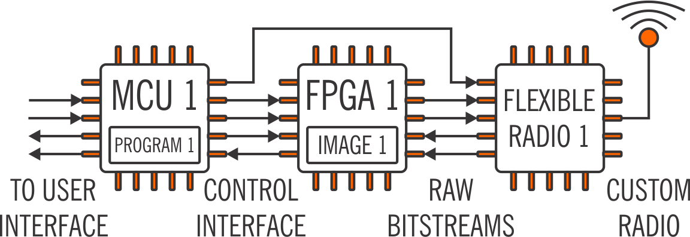
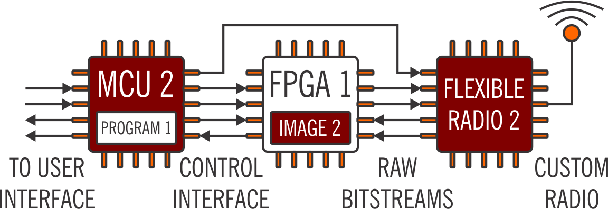
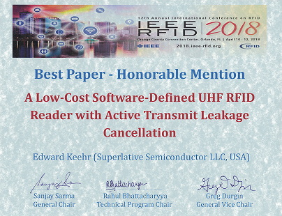
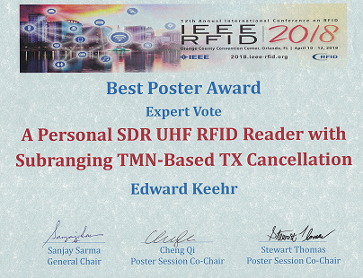

# About S.U.R.F.E.R.

<b>S.U.R.F.E.R.</b> is a low-cost, open UHF RFID reader platform.

<b>S.U.R.F.E.R.</b> is an acronym for: 
<b>S</b>oftware-Defined <b>U</b>HF <b>R</b>FID 
<b>F</b>lexible <b>E</b>conomical <b>R</b>eader.

Broadly, the goal of the S.U.R.F.E.R. program is to increase the 
proliferation and use cases of UHF RFID and other long-range backscatter 
communications technologies worldwide.

For detailed information about how to use and understand the technical
aspects of the S.U.R.F.E.R., please visit the [project wiki](https://github.com/surfer-rfid/surfer-rfid-wiki/wiki).

# What is UHF RFID?

<b>UHF</b> is an acronym for: <b>U</b>ltra <b>H</b>igh <b>F</b>requency. (860-960MHz)

<b>RFID</b> is an acronym for: <b>R</b>adio <b>F</b>requency <b>ID</b>entification.

UHF RFID is a technology in which a reader and a tag communicate at a 
distance of up to 2 to 20 meters, depending on the specifics of the setup.
The reader interrogates the tag to obtain information such as a unique ID
or environmental characteristics, such as temperature or air pressure.

UHF RFID tags are either active or passive. Active UHF RFID tags are partially
powered by a battery. Passive tags power themselves through ambient radio 
energy, most often from the reader itself. Passive UHF RFID tags are incredibly 
cheap, ranging down to $0.05 per tag in bulk, and often come with adhesive backing. 
This means that they can be deployed quickly and <i>en masse</i>, with little regard
to long-term maintenance requirements.

# Where is UHF RFID used?

Typically, UHF RFID is used when precise identification is needed at a distance.
While computer vision is increasingly used for this purpose, UHF RFID is still 
an attractive option going forward in markets where:

- Concerns about privacy discourage use of video monitoring (e.g. inside the home).
- There exists a lack of repeatable visual identifiers (e.g. skiiers with masked faces).
- Identification must be kept in a secure and hidden location (e.g. inside of tires).

It is our hope that researchers and students in the laboratory, in industry, or in 
the garage can use the S.U.R.F.E.R. platform to explore novel use cases of UHF RFID.

# Are there other types of RFID?

Yes, High-Frequency (HF) tags are often used for hotel key card and book tracking.
Low-frequency (LF) tags are often used for animal tracking and key fobs.
The ranges and data rates of these systems are substantially smaller than for UHF RFID. 
However, the lower frequency confers other advantages such as good performance near objects
made of metal or living tissue.

# What is Software-Defined?

Software-defined refers to a method of building electronic systems with 
non-application-specific physical components and adding specificity through 
programmable means. A software-defined radio system typically contains a 
wideband radio transceiver integrated circuit (IC) which exposes raw data bits at its
digital interface, a field-programmable gate array (FPGA), and some sort of
higher-level computing element such as a microcontroller unit (MCU).

For example, while S.U.R.F.E.R. has special circuitry to help it operate 
as a UHF RFID reader, it could just as easily operate as a utility monitoring 
hub, or a radio control in the 860-960MHz range with new MCU and FPGA flash images.

Software-defined systems are advantageous over systems comprised of hardened
application-specific integrated circuits (ASICs) in terms of flexibility, 
and often in terms of economic considerations.

# Economical

Publicly accessible ASICs can often be expensive. With the advent of low-cost flexible 
radio ICs and FPGAs, building systems which previously required such ASICs now becomes 
attractive to do so in a software-defined manner.

The core of the S.U.R.F.E.R. design consists of a flexible radio integrated
circuit (IC), a transmit (TX) cancellation network, and an FPGA that altogether costs 
about $9 USD in bulk. Comparable setups using specialized UHF RFID reader ASICs can 
cost 2.5x-5x this amount. The S.U.R.F.E.R. core design can also be controlled by a 
low-cost ARM Cortex-M0 MCU with 256kB of flash memory.

# Flexible

Software-defined systems provide flexibility in two ways:

1. Flexibility through choice of programming.
2. Flexibility through choice of component selection.

The first of these has already been discussed. 
Within a given application, however, programming permits:

- Over-the-air feature and bug updates to hardware.
- Easy, real-time experimentation with novel system modifications.

In the case of S.U.R.F.E.R., the flexible nature permits customized implementations
of RFID protocols for industrial or academic research. Multi-$1000 software-defined
radio platforms with high-end FPGAs have traditionally been used for this purpose
but they are bulky and expensive. Conversely, the small size and bill-of-material (BOM) 
cost of the S.U.R.F.E.R. facilitates experimentation with installations requiring many 
UHF RFID readers.

Flexibility through choice of component selection can mean:

- Reduced risk of part obsolecence or lack of availability.
Sometimes chip product lines are discontinued or are purchased by a vendor
who makes working with the chip difficult. On the other hand, it's safe
to assume that there will always be publicly available flexible radio chips, FPGAs,
and MCUs with extensive documentation.

- Lower prices as time goes on.
The generic IC market is large and is not going away. In fact, it will probably get bigger.
We can therefore expect that the price of ICs in this market will drop as time goes on.

# Publications and Awards

The S.U.R.F.E.R. project was originally described at the [2018 IEEE RFID Conference](https://2018.ieee-rfid.org/) 
in two publications and a poster accompanied by a live demonstration. At this conference, it won the following awards:

| Best Paper: Honorable Mention | Best Poster: Expert Vote |
| --- | --- |
|  |  |

Since then, the S.U.R.F.E.R. project has been invited to appear:

- At the RFID Workshop at the [2019 IEEE International Microwave Symposium](https://2019.ims-ieee.org/).
- In the March 2021 issue of [IEEE Microwave Magazine](https://ieeexplore.ieee.org/xpl/RecentIssue.jsp?punumber=6668).

# Collaborations

Currently, the S.U.R.F.E.R. is being evaluated by academic partners in
machine learning systems [which detect and interpret actions applied to 
objects with UHF RFID tags applied to them](https://www.youtube.com/watch?v=Ii06qwOgaEI ).

# Contact

The S.U.R.F.E.R. project was initiated and is currently maintained by [Superlative Semiconductor LLC](http://www.super-semi.com).
Please direct any inquiries regarding the S.U.R.F.E.R. project [here](mailto:surfer@super-semi.com).

